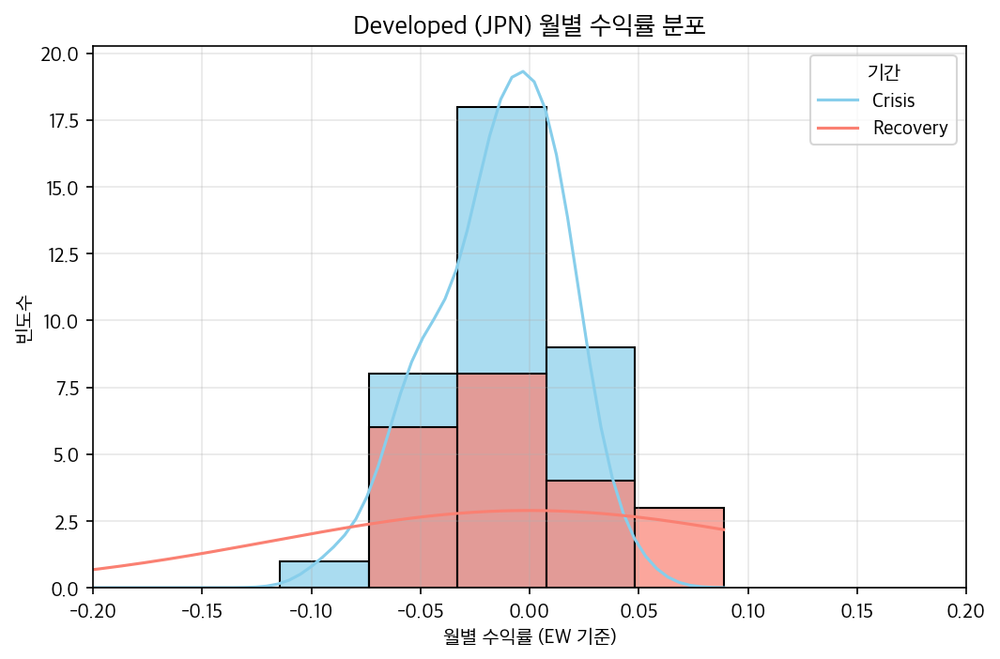
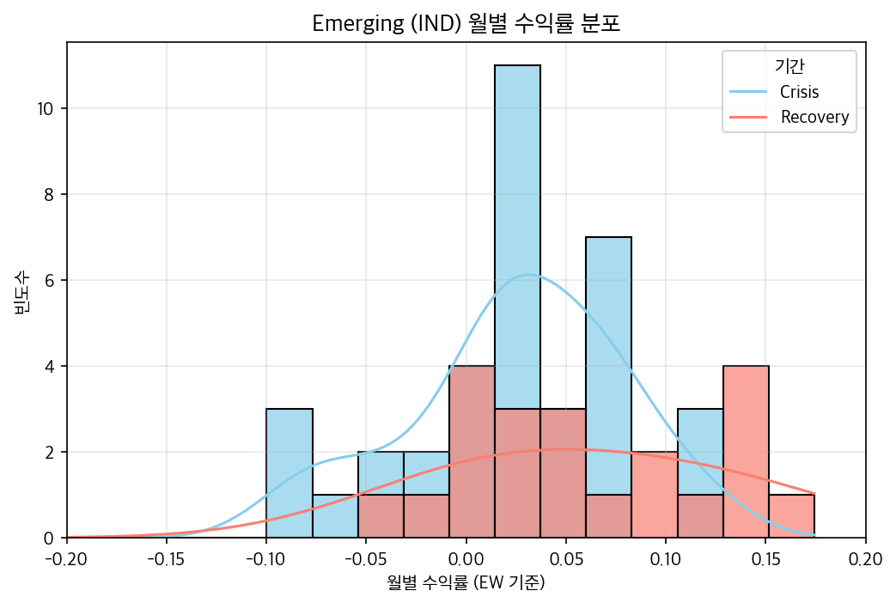

<h1>📘 FinancialDataAnalytics – Homework 1</h1>

> <b>주제:</b> Global Compustat 데이터를 활용한 국가별 월별 수익률 분석 (2020–2025) <br>
> <b>도구:</b> Python + WRDS + pandas <br>
> <b>목표:</b> 기업별·국가별 월간 주식 수익률을 생성하고, 선진국과 신흥국 간 수익률 특성을 비교 및 시각화한다. <br>

<hr>

<h2>📂 프로젝트 구조</h2>

<pre>
project/
├── data/
│   ├── collectData.csv                     ✅ 데이터 수집 결과 (WRDS → CSV)
│   ├── outPutData.csv                      ✅ 국가별 수익률 계산 결과
│   ├── outputDataCovid.csv                 ✅ Covid-19 기간 라벨 추가
│   ├── outputDataSummary.csv               ✅ 국가·기간별 기술통계 요약
│   ├── comparison_developed_vs_emerging.csv✅ 선진국 vs 신흥국 비교 결과
│   ├── correlation_crisis.csv              ✅ Crisis 기간 국가 간 상관행렬
│   ├── correlation_recovery.csv            ✅ Recovery 기간 국가 간 상관행렬
│   └── correlation_summary.csv             ✅ 그룹별 평균 상관계수 요약
│
├── figures/
│   ├── hist_JPN_period_fixed.png           ✅ 대표 선진국(일본) 월별 수익률 분포
│   ├── hist_IND_period_fixed.png           ✅ 대표 신흥국(인도) 월별 수익률 분포
│   ├── descriptive_summary_table.csv       ✅ 기술통계 요약표
│   └── discussion_summary.txt              ✅ 결과 해석 요약 텍스트
│
├── subject/
│   ├── connectModule.py                    ✅ WRDS 연결 및 테이블 탐색
│   ├── collectModule.py                    ✅ Global Compustat 데이터 수집
│   ├── analyzeModule.py                    ✅ 수익률 계산 및 국가별 집계
│   ├── periodModule.py                     ✅ Covid-19 기간 정의
│   ├── summaryModule.py                    ✅ 국가·기간별 기술통계 산출
│   ├── comparisonModule.py                 ✅ Developed vs Emerging 비교
│   ├── correlationModule.py                ✅ 상관행렬 및 금융전이 분석
│   ├── presentationModule.py               ✅ 결과 요약·시각화·해석 (Problem 7)
│   └── main.py                             ✅ 전체 파이프라인 실행
</pre>

<hr>

<h2>🚀 전체 워크플로우 요약</h2>

<h3>✅ Problem 1. WRDS 연결 및 데이터 수집</h3>

- <b>테이블:</b> comp.g_secm (Global Compustat)
- <b>분석대상:</b> 10개국  
  🇬🇧 영국 | 🇩🇪 독일 | 🇯🇵 일본 | 🇫🇷 프랑스 | 🇦🇺 호주 <br>
  🇨🇳 중국 | 🇮🇳 인도 | 🇧🇷 브라질 | 🇿🇦 남아프리카 | 🇹🇷 튀르키예
- <b>기간:</b> 2020년 3월 ~ 2024년 12월  
- 결과 파일: <code>data/collectData.csv</code>

<table>
<tr><th>컬럼명</th><th>설명</th></tr>
<tr><td>gvkey, iid</td><td>기업 및 증권 식별자</td></tr>
<tr><td>datadate</td><td>데이터 기준 월말 날짜</td></tr>
<tr><td>loc, fic</td><td>상장국가 / 법인등록국가</td></tr>
<tr><td>prccm</td><td>월말 주가 (local currency)</td></tr>
<tr><td>cshtrm</td><td>월간 거래주식수</td></tr>
<tr><td>curcdm</td><td>통화코드</td></tr>
<tr><td>country</td><td>상장국가 코드</td></tr>
</table>

<br>

<h3>✅ Problem 2. 수익률 계산 (EW/VW)</h3>

- 개별 기업의 월간 수익률 계산 후, 국가 단위로  
  <b>Equal-Weighted (EW)</b> / <b>Value-Weighted (VW)</b> 집계  
- 결과 파일: <code>data/outPutData.csv</code>

| country | datadate | ew_return | vw_return |
|----------|-----------|-----------|-----------|
| JPN | 2020-03-31 | -0.045 | -0.042 |
| GBR | 2020-03-31 | -0.031 | -0.028 |
| AUS | 2020-03-31 | -0.055 | -0.059 |

<br>

<h3>✅ Problem 3. 기간 정의 (Covid-19 위기 vs 회복기)</h3>

| 구분 | 기간 | 라벨 |
|------|------|------|
| Crisis (위기기) | 2020년 3월 ~ 2021년 12월 | “Crisis” |
| Recovery (회복기) | 2022년 1월 ~ 2024년 12월 | “Recovery” |

결과 파일: <code>data/outputDataCovid.csv</code>

<br>

<h3>✅ Problem 4. 국가 및 기간별 요약 통계</h3>

- 각 국가(country)와 기간(period)별로 평균(mean), 중앙값(median), 표준편차(std),  
  왜도(skew), 첨도(kurtosis) 등 계산  
- 결과 파일: <code>data/outputDataSummary.csv</code>

<br>

<h3>✅ Problem 5. Developed vs Emerging Markets 비교</h3>

| 그룹 | 기간 | 평균 | 표준편차 | 왜도 | 초과첨도 |
|------|------|-----------|-----------|-----------|-----------|
| Developed | Crisis | -0.028 | 0.081 | 0.54 | 1.12 |
| Emerging | Crisis | -0.053 | 0.114 | 0.87 | 2.45 |
| Developed | Recovery | 0.015 | 0.043 | -0.12 | 0.69 |
| Emerging | Recovery | 0.019 | 0.065 | -0.09 | 1.08 |

결과 파일: <code>data/comparison_developed_vs_emerging.csv</code>

<br>

<h3>✅ Problem 6. 상관관계 및 금융 전이 효과</h3>

- Crisis / Recovery 각 기간별 국가 간 월별 수익률 상관행렬 계산  
- 그룹별 평균 상관계수 도출 (선진국 vs 신흥국)

결과 파일:
<ul>
<li>data/correlation_crisis.csv</li>
<li>data/correlation_recovery.csv</li>
<li>data/correlation_summary.csv</li>
</ul>

<br>

<h3>✅ Problem 7. 결과 발표 (시각화 및 요약)</h3>

<h4>(a) 국가·기간·그룹별 기술통계 요약</h4>
➡️ <code>figures/descriptive_summary_table.csv</code>

<h4>(b) 대표 국가 월별 수익률 히스토그램</h4>

<table>
<tr>
<th>Developed (JPN)</th>
<th>Emerging (IND)</th>
</tr>
<tr>
<td></td>
<td></td>
</tr>
</table>

<h4>(c) 결과 해석 요약</h4>
➡️ <code>figures/discussion_summary.txt</code>

<pre>
🧠 [결과 요약]
1️⃣ Crisis 기간: 수익률 분포 좌측 치우침, 변동성 확대, fat-tail 현상  
2️⃣ Recovery 기간: 수익률 평균 상승, 첨도 감소  
3️⃣ 선진국(JPN)은 안정적, 신흥국(IND)은 극단값 빈도 높음  
</pre>

<hr>

<h2>🧠 연구 요약 (Discussion)</h2>

Crisis 기간 동안 신흥국은 선진국보다 훨씬 높은 변동성과 fat-tail 특성을 보였으며,
Recovery 단계에서 평균 수익률이 빠르게 반등하나 분포의 안정성은 여전히 낮음. <br>
선진국 시장은 회복기에도 비교적 안정적인 분포 형태를 유지하며,
이는 금융시장의 구조적 안정성과 정보 비대칭 차이에 기인한 결과로 해석됨.

<h2>🧩 실행 방법</h2>

```bash
# 1. 가상환경 실행 (선택)
source .venv/bin/activate   # macOS/Linux
.venv\Scripts\activate      # Windows

# 2. 메인 파이프라인 전체 실행
python subject/main.py

# 3. Problem 7만 시각화 실행
python subject/presentationModule.py


