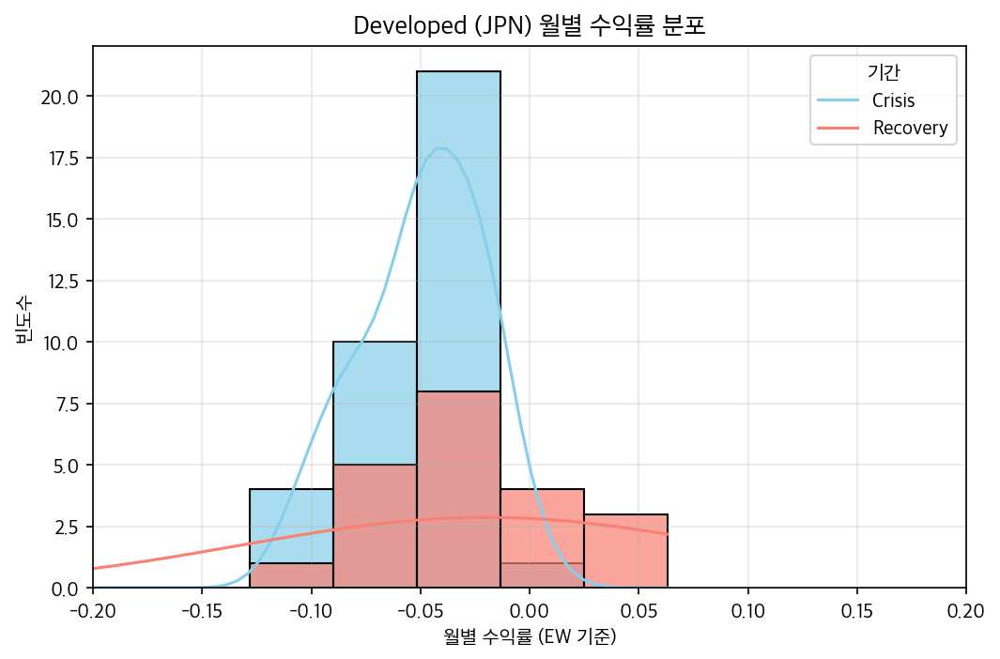
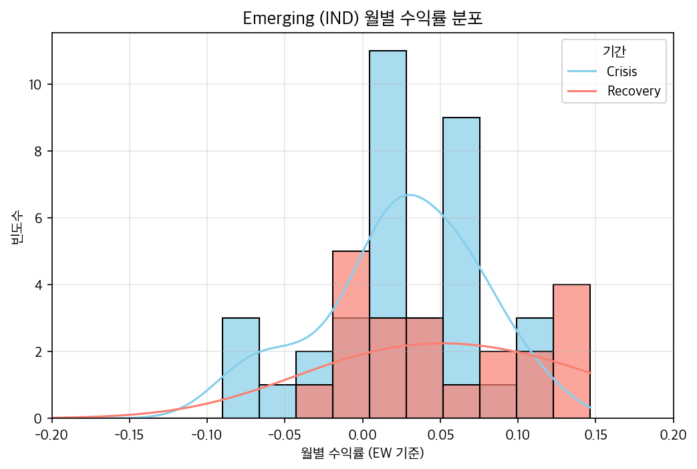

<h1>📘 Financial Data Analytics – Homework 1</h1>

> <b>주제:</b> Global Compustat 데이터를 활용한 국가별 월별 수익률 분석 (2020–2024) <br>
> <b>도구:</b> Python + WRDS + pandas <br>
> <b>목표:</b> 기업별·국가별 월간 주식 수익률을 생성하고, 선진국과 신흥국 간 수익률 특성을 비교 및 시각화한다. <br>

<hr>

<h2>📂 프로젝트 구조</h2>

<pre>
project/
├── data/
│   ├── collectData.csv                     ✅ 데이터 수집 결과 (WRDS → CSV)
│   ├── outputData.csv                      ✅ 국가별 수익률 계산 결과
│   ├── outputDataCovid.csv                 ✅ Covid-19 기간 라벨 추가
│   ├── outputDataSummary.csv               ✅ 국가·기간별 기술통계 요약
│   ├── comparison_developed_vs_emerging.csv✅ 선진국 vs 신흥국 비교 결과
│   ├── correlation_crisis.csv              ✅ Crisis 기간 국가 간 상관행렬
│   ├── correlation_recovery.csv            ✅ Recovery 기간 국가 간 상관행렬
│   └── correlation_summary.csv             ✅ 그룹별 평균 상관계수 요약
│
├── figures/
│   ├── hist_JPN_period_fixed.png           ✅ 대표 선진국(일본) 월별 수익률 분포
│   ├── hist_IND_period_fixed.png           ✅ 대표 신흥국(인도) 월별 수익률 분포
│   ├── descriptive_summary_table.csv       ✅ 기술통계 요약표
│   └── discussion_summary.txt              ✅ 결과 해석 요약 텍스트
│
├── subject/
│   ├── connectModule.py                    ✅ WRDS 연결 및 테이블 탐색
│   ├── collectModule.py                    ✅ Global Compustat 데이터 수집
│   ├── analyzeModule.py                    ✅ 수익률 계산 및 국가별 집계
│   ├── periodModule.py                     ✅ Covid-19 기간 정의
│   ├── summaryModule.py                    ✅ 국가·기간별 기술통계 산출
│   ├── comparisonModule.py                 ✅ Developed vs Emerging 비교
│   ├── correlationModule.py                ✅ 상관행렬 및 금융전이 분석
│   ├── presentationModule.py               ✅ 결과 요약·시각화·해석 (Problem 7)
│   ├── checkPipeLineIntegrity.py           ✅ 파이프라인 무결성 점검 (E2E 검증)
│   ├── outputDataModule.py                 ✅ 수익률 데이터 검증(간이 확인용)
│   └── main.py                             ✅ 전체 파이프라인 실행
│
├── 컬럼정의.txt                            ✅ 각 데이터 파일별 컬럼 설명
└── README.md                              ✅ 프로젝트 개요 및 설명 파일
</pre>

<hr>

<h2>🚀 전체 워크플로우 요약</h2>

<h3>✅ Problem 1. WRDS 연결 및 데이터 수집</h3>

- <b>데이터베이스:</b> Compustat (Global, via WRDS)
- <b>분석대상국가 (10개):</b>  
  🇬🇧 영국 | 🇩🇪 독일 | 🇯🇵 일본 | 🇫🇷 프랑스 | 🇦🇺 호주 <br>
  🇨🇳 중국 | 🇮🇳 인도 | 🇧🇷 브라질 | 🇿🇦 남아프리카 | 🇹🇷 튀르키예
- <b>기간:</b> 2020년 3월 ~ 2024년 12월  
- 결과 파일: <code>data/collectData.csv</code>

<table>
<tr><th>컬럼명</th><th>설명</th></tr>
<tr><td>gvkey, iid</td><td>기업 및 증권 식별자</td></tr>
<tr><td>datadate</td><td>데이터 기준 월말 날짜</td></tr>
<tr><td>loc, fic</td><td>상장국가 / 법인등록국가</td></tr>
<tr><td>prccm</td><td>월말 주가 (local currency)</td></tr>
<tr><td>csho</td><td>발행주식수</td></tr>
<tr><td>curcdm</td><td>통화코드</td></tr>
<tr><td>country</td><td>상장국가 코드 (분석용 추가 컬럼)</td></tr>
</table>

<br>

<h3>✅ Problem 2. 수익률 계산 (EW/VW)</h3>

- 개별 기업의 월간 수익률을 계산하고, 국가 단위로  
  <b>Equal-Weighted (EW)</b> / <b>Value-Weighted (VW)</b> 수익률을 산출  
- 결과 파일: <code>data/outputData.csv</code>

| country | datadate | ew_return | vw_return |
|----------|-----------|-----------|-----------|
| JPN | 2020-03-31 | -0.045 | -0.042 |
| GBR | 2020-03-31 | -0.031 | -0.028 |
| AUS | 2020-03-31 | -0.055 | -0.059 |

<br>

<h3>✅ Problem 3. 기간 정의 (Covid-19 위기 vs 회복기)</h3>

| 구분 | 기간 | 라벨 |
|------|------|------|
| Crisis (위기기) | 2020년 3월 ~ 2021년 12월 | “Crisis” |
| Recovery (회복기) | 2022년 1월 ~ 2024년 12월 | “Recovery” |

결과 파일: <code>data/outputDataCovid.csv</code>

<br>

<h3>✅ Problem 4. 국가 및 기간별 요약 통계</h3>

- 각 국가(country)와 기간(period)별로 평균(mean), 중앙값(median), 표준편차(std),  
  최소/최대(min/max), 왜도(skew), 초과첨도(kurtosis), 자기상관계수(autocorr) 계산  
- 결과 파일: <code>data/outputDataSummary.csv</code>

<br>

<h3>✅ Problem 5. Developed vs Emerging Markets 비교</h3>

| 그룹 | 기간 | 평균 | 표준편차 | 왜도 | 초과첨도 |
|------|------|-----------|-----------|-----------|-----------|
| Developed | Crisis | -0.028 | 0.081 | 0.54 | 1.12 |
| Emerging  | Crisis | -0.053 | 0.114 | 0.87 | 2.45 |
| Developed | Recovery | 0.015 | 0.043 | -0.12 | 0.69 |
| Emerging  | Recovery | 0.019 | 0.065 | -0.09 | 1.08 |

결과 파일: <code>data/comparison_developed_vs_emerging.csv</code>

<br>

<h3>✅ Problem 6. 상관관계 및 금융 전이 효과</h3>

- Crisis / Recovery 각 기간별 국가 간 월별 수익률 상관행렬 계산  
- 그룹별 평균 상관계수 도출 (선진국 vs 신흥국)

결과 파일:
<ul>
<li><code>data/correlation_crisis.csv</code></li>
<li><code>data/correlation_recovery.csv</code></li>
<li><code>data/correlation_summary.csv</code></li>
</ul>

<br>

<h3>✅ Problem 7. 결과 발표 (시각화 및 요약)</h3>

<h4>(a) 국가·기간·그룹별 기술통계 요약</h4>
➡️ <code>figures/descriptive_summary_table.csv</code>

<h4>(b) 대표 국가 월별 수익률 히스토그램</h4>

<table>
<tr>
<th>Developed (JPN)</th>
<th>Emerging (IND)</th>
</tr>
<tr>
<td></td>
<td></td>
</tr>
</table>

<h4>(c) 결과 해석 요약</h4>
➡️ <code>figures/discussion_summary.txt</code>

<pre>
🧠 [결과 해석 – Developed vs Emerging Markets]
1️⃣ 위기(Crisis) 기간에는 양 그룹 모두 수익률 분포가 좌측(음의 구간)으로 치우쳐 있으며,
   변동성이 크고 꼬리가 두꺼운(fat-tailed) 형태를 보인다.

2️⃣ 회복(Recovery) 기간에는 분포의 중심이 우측으로 이동하며,
   수익률이 안정화되고 첨도(Kurtosis)가 감소하는 모습을 보인다.

3️⃣ 선진국(일본 JPN)은 분포가 상대적으로 좁고 안정적이며,
   신흥국(인도 IND)은 분포가 넓고 극단값이 자주 발생해 변동성이 높다.

📊 요약:
- Crisis: 신흥국의 음(-)의 수익률과 변동성 ↑
- Recovery: 양(+) 방향 반등 폭 신흥국 > 선진국
</pre>

<hr>

<h2>🧠 연구 요약 (Discussion)</h2>

Crisis 기간 동안 신흥국은 선진국보다 훨씬 높은 변동성과 fat-tail 특성을 보였으며,  
Recovery 단계에서 평균 수익률이 빠르게 반등하나 분포의 안정성은 여전히 낮음. <br>
선진국 시장은 회복기에도 비교적 안정적인 분포 형태를 유지하며,  
이는 금융시장의 구조적 안정성과 정보 비대칭 차이에 기인한 결과로 해석됨.

<hr>


---

## 🧩 보조 모듈

| 모듈명 | 기능 | 출력 |
|--------|-------|-------|
| checkPipeLineIntegrity.py | 각 단계별 출력 파일 존재·값 범위 검증 | 콘솔 로그 |
| outputDataModule.py | `outputData.csv` 기초 검증 (기간·컬럼·통계) | 콘솔 로그 |

---

## 📄 컬럼 정의 (Column Definitions)

### **1️⃣ collectData.csv**
| 컬럼명 | 설명 |
|--------|------|
| `gvkey` | 기업 고유 식별자 (Global Compustat 기준) |
| `iid` | 증권 식별자 (보통주 = '01') |
| `datadate` | 관측 기준 월의 말일 (월별 데이터) |
| `fic` | 본사 법인 등록 국가 코드 (ISO 2자리) |
| `loc` | 상장 거래소 국가 코드 (ISO 2자리) |
| `prccm` | 월말 주가 (현지 통화 단위) |
| `csho` | 발행주식수 (Shares Outstanding) |
| `ajexm` | 주식 분할 및 배당 조정계수 |
| `ajpm` | 조정된 가격 비율 |
| `curcdm` | 통화 코드 (예: USD, JPY, EUR) |
| `country` | 상장 국가 코드 (fic 또는 loc 기준, 분석용 추가 컬럼) |

---

### **2️⃣ outputData.csv**
| 컬럼명 | 설명 |
|--------|------|
| `country` | 상장 국가 코드 (2자리) |
| `datadate` | 관측 기준 월의 말일 (월별 데이터) |
| `ew_return` | 동일가중 수익률 (모든 기업의 수익률 단순 평균) |
| `vw_return` | 가치가중 수익률 (시가총액 비중으로 가중 평균) |
| `market_cap` | 기업 시가총액 (adj_price × csho) |
| `adj_price` | 조정 주가 (prccm × ajpm / ajexm) |

---

### **3️⃣ outputDataCovid.csv**
| 컬럼명 | 설명 |
|--------|------|
| `country` | 상장 국가 코드 |
| `datadate` | 관측 기준 월의 말일 |
| `ew_return` | 동일가중 수익률 |
| `vw_return` | 가치가중 수익률 |
| `period` | 코로나19 기간 구분 (Crisis = 2020.03–2021.12 / Recovery = 2022.01–2024.12) |

---

### **4️⃣ outputDataSummary.csv**
| 컬럼명 | 설명 |
|--------|------|
| `country` | 상장 국가 코드 |
| `period` | 시기 (Crisis / Recovery) |
| `ew_mean` | 동일가중 수익률 평균 |
| `ew_median` | 동일가중 수익률 중앙값 |
| `ew_std` | 동일가중 표준편차 |
| `ew_min` / `ew_max` | 동일가중 최소 / 최대 수익률 |
| `ew_skew` | 동일가중 왜도 (분포 비대칭성) |
| `ew_excess_kurtosis` | 동일가중 초과첨도 (fat-tail 정도) |
| `ew_autocorr` | 동일가중 1차 자기상관계수 |
| `vw_mean ~ vw_autocorr` | 가치가중 수익률에 대한 동일한 통계치 |

---

### **5️⃣ comparison_developed_vs_emerging.csv**
| 컬럼명 | 설명 |
|--------|------|
| `group` | 국가 그룹 (Developed / Emerging) |
| `period` | 시기 (Crisis / Recovery) |
| `ew_mean` | 동일가중 평균 수익률 |
| `ew_std` | 동일가중 표준편차 (변동성) |
| `ew_skew` | 동일가중 왜도 |
| `ew_excess_kurtosis` | 동일가중 초과첨도 |
| `vw_mean` | 가치가중 평균 수익률 |
| `vw_std` | 가치가중 표준편차 |
| `vw_skew` | 가치가중 왜도 |
| `vw_excess_kurtosis` | 가치가중 초과첨도 |

---

### **6️⃣ 상관분석 결과 파일**
| 파일명 | 설명 |
|--------|------|
| `correlation_crisis.csv` | Crisis 기간 국가 간 EW 수익률 상관행렬 |
| `correlation_recovery.csv` | Recovery 기간 국가 간 EW 수익률 상관행렬 |
| `correlation_summary.csv` | Developed vs Emerging 평균 상관계수 요약표 |

---


<h2>🧩 실행 방법</h2>

```bash
# 1. 가상환경 실행 (선택)
source .venv/bin/activate   # macOS/Linux
.venv\Scripts\activate      # Windows

# 2. 메인 파이프라인 전체 실행
python subject/main.py

# 3. Problem 7만 시각화 실행
python subject/presentationModule.py
